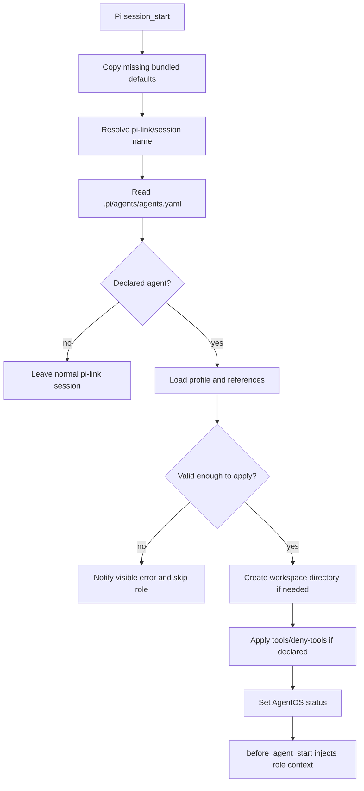

# feat: Build pi-agentos Pi extension

## Summary

Build `pi-agentos` as a standalone Pi package that maps existing `pi-link <agent-name>` sessions to AgentOS profiles declared in `.pi/agents/agents.yaml`. The package will ship default agents, copy only missing defaults into projects, apply active profile context at runtime, enforce declared tool policy where Pi supports it, and stay installable from GitHub as `pi-agentos`.

---

## Problem Frame

`pi-link <name>` already starts named linked Pi sessions and passes the link identity into Pi. The missing layer is a project-local AgentOS runtime: when the link name matches an AgentOS registry entry, the session should act as that role without patching pi-link or changing normal Pi behavior for undeclared names.

---

## Requirements

**Packaging and install**

- R1. The repo must be a Pi package named `pi-agentos` with a `package.json` `pi.extensions` entry.
- R2. The package must be installable from a GitHub repo through Pi's git package install flow.
- R3. The package must treat Pi coding agent and pi-link as prerequisites, not bundled replacements.
- R4. The package must not depend on pi-subagents.

**Default agent sync**

- R5. The package must ship the default AgentOS agent directory as package contents, including `agents.yaml`, profile markdown, rules, docs, and checklists.
- R6. On first extension load after project install, the extension must ensure the project root has `.pi/agents`.
- R7. Default sync must copy bundled default AgentOS directory contents into project root `.pi/agents` only when a target file is missing.
- R8. Default sync must never create `.new` files, warnings, overwrites, deletes, or renames for existing files.

**Agent resolution**

- R9. The extension must resolve the active role from pi-link's session/link name when available.
- R10. Only entries declared in `.pi/agents/agents.yaml` are valid AgentOS launch targets.
- R11. Each registry agent entry requires only `id` and `profile`.
- R12. Unknown link names must leave the session as normal pi-link behavior.
- R13. A declared agent with a missing or invalid profile must fail visibly and avoid partial role activation.

**Profile runtime**

- R14. The active profile body must be appended to the session's system prompt.
- R15. Declared rules, docs, and checklists must be loaded into the role context when readable.
- R16. Missing referenced files must be visible errors or warnings, not silent omissions.
- R17. Declared `tools` and `deny-tools` must be applied through `pi.setActiveTools` when present.
- R18. Missing tool policy means keep Pi's current default active tools.
- R19. Unsupported or unknown tool names must be visibly reported, with safe partial application only when the remaining policy is still meaningful.
- R20. Declared `skills` must be exposed in the prompt and checked against available skills when Pi exposes that metadata.

**Workspace behavior**

- R21. If `cwd` is blank, omitted, or `parent`, the profile workspace is the project root.
- R22. If `cwd` is another relative path, the extension must create that directory under the project root.
- R23. Workspace paths must not escape the project root.
- R24. The extension must not change the Pi process cwd or make native file tools operate from the workspace.
- R25. The extension must not create README, status, log, or standard work files inside the workspace.

**Compatibility**

- R26. Without `pi-agentos` loaded, Pi and pi-link behavior must be unchanged.
- R27. With `pi-agentos` loaded, undeclared link names must behave like normal pi-link sessions.
- R28. The active AgentOS role must be visible to the user when a role is applied.

---

## Key Technical Decisions

- **Pure Pi package over launcher wrapper:** Use Pi extension hooks and pi-link's existing identity handoff instead of patching or replacing `pi-link`; this preserves the prerequisite boundary.
- **JavaScript extension over TypeScript build:** Use ESM `.js` files so GitHub install needs no compile step; Pi can load the extension directly and tests can run with Node's built-in runner.
- **Package defaults live outside `.pi`:** Store bundled defaults in `agents/` and copy them into project `.pi/agents/`; the package repo should not pretend its own bundled defaults are a project install.
- **YAML dependency over handwritten parser:** Use the `yaml` package for registry/profile frontmatter parsing; a small dependency is less fragile than a custom YAML subset.
- **Two-layer runtime:** Keep pure parsing/resolution/sync logic in `agentos.js` and Pi event wiring in `index.js`; this gives useful tests without mocking the full Pi runtime.
- **Resolve active name defensively:** Check `process.env.PI_LINK_NAME`, `pi.getSessionName()`, and pi-link's saved `link-name` session entry where available, because extension event order with pi-link should not be load-bearing.
- **Tool policy replaces or subtracts:** If `tools` is present, active tools become `tools - deny-tools`; if only `deny-tools` is present, active tools become current active tools minus denied tools; if neither is present, leave active tools alone.
- **Prompt injection is the role boundary:** Profile body and references are injected in `before_agent_start`, while session startup handles sync, name resolution, workspace creation, tool policy, status, and validation.

---

## Output Structure

```text
package.json
README.md
LICENSE
index.js
agentos.js
agents/
  agents.yaml
  *.md
  rules/*.md
  checklists/*.md
  docs/*.md
test/
  agentos.test.mjs
```

---

## High-Level Technical Design



---

## Implementation Units

### U1. Package scaffold and bundled defaults

- **Goal:** Create the standalone Pi package repo layout and ship the full default AgentOS directory.
- **Requirements:** R1-R8, R26
- **Dependencies:** None
- **Files:**
  - `package.json`
  - `README.md`
  - `LICENSE`
  - `agents/agents.yaml`
  - `agents/*.md`
  - `agents/rules/*.md`
  - `agents/checklists/*.md`
  - `agents/docs/*.md`
- **Approach:** Define `pi-agentos` with `type: module`, `keywords: ["pi-package"]`, `pi.extensions: ["./index.js"]`, and a `yaml` runtime dependency. Include the full default AgentOS catalog in package `agents/`; first extension load after install copies those defaults into project root `.pi/agents` without overwriting.
- **Patterns to follow:** `pi-link/package.json` uses a `pi` manifest with extension entry; Pi package docs show GitHub install support and dependency install behavior.
- **Test scenarios:**
  - Test expectation: none for package metadata beyond install/lint verification in U6.
- **Verification:** Package metadata exposes `index.js` as the extension and includes every default file needed to populate a project's `.pi/agents` directory.

### U2. Pure AgentOS loader, path, and sync helpers

- **Goal:** Implement tested pure functions for safe default sync, registry parsing, profile loading, reference resolution, and workspace path resolution.
- **Requirements:** R5-R16, R21-R25
- **Dependencies:** U1
- **Files:**
  - `agentos.js`
  - `test/agentos.test.mjs`
- **Approach:** Export helpers that accept project root and package default root paths. Copy package `agents/` into project `.pi/agents/` only when missing. Parse `agents.yaml` with required `id` and `profile`; parse profile frontmatter for optional `cwd`, `tools`, `deny-tools`, `skills`, `rules`, `checklists`, and `docs`. Resolve all project paths under the project root and reject traversal.
- **Technical design:** Directional helper boundaries: `syncDefaults`, `loadRegistry`, `resolveAgent`, `loadProfile`, `resolveWorkspace`, `loadReferences`, and `buildRoleContext`.
- **Patterns to follow:** The old AgentOS extension reference already has useful path-resolution and profile-loading ideas, but new code must follow the updated requirements: no default overwrites and `cwd: parent` equals project root.
- **Test scenarios:**
  - Given a missing `.pi/agents`, sync creates the directory and copies bundled files.
  - Given an existing target file with different content, sync leaves it unchanged and does not create a sidecar file.
  - Given a registry entry with only `id` and `profile`, parsing accepts it.
  - Given an entry missing `id` or `profile`, parsing returns a visible validation error.
  - Given `cwd` is missing, blank, or `parent`, workspace resolves to the project root and no directory is created.
  - Given `cwd: agents-work/builder`, workspace resolves inside the project and the directory can be created.
  - Given `cwd: ../outside`, resolution rejects it.
  - Given a missing referenced rule/doc/checklist, resolution reports it without silently omitting the reference.
- **Verification:** Node tests prove sync safety, registry requirements, reference reporting, and workspace escape prevention.

### U3. Pi extension session startup integration

- **Goal:** Wire the pure helpers into Pi lifecycle hooks without changing pi-link behavior.
- **Requirements:** R6-R13, R21-R28
- **Dependencies:** U2
- **Files:**
  - `index.js`
  - `agentos.js`
  - `test/agentos.test.mjs`
- **Approach:** On `session_start`, sync defaults, resolve the active link/session name, load the matching registry entry, validate the profile, create the private workspace if needed, persist minimal active-role state in memory, and show status/notifications. If no matching registry entry exists, clear active-role state and do nothing else.
- **Technical design:** Directional name resolution order: `PI_LINK_NAME` if present, Pi session name, latest custom `link-name` entry from the session branch. The implementation should not depend on pi-link running before or after pi-agentos.
- **Patterns to follow:** Pi docs document `session_start`, `ctx.ui.notify`, status UI, and session-manager custom entries; pi-link stores `link-name` and sets the session name only for wrapper-launched sessions.
- **Test scenarios:**
  - Given `PI_LINK_NAME=builder`, active name resolves to `builder`.
  - Given no env value but session name `builder`, active name resolves to `builder`.
  - Given no matching registry entry, startup returns no active role and no tool changes.
  - Given a matching registry entry with invalid profile, startup reports an error and does not set active role.
  - Covers AE3. Given undeclared `scratch`, no role context is injected.
- **Verification:** Unit tests cover name-resolution and activation decisions; manual Pi startup later confirms notifications/status in a real session.

### U4. Prompt/context injection and skill visibility

- **Goal:** Make an active linked session act as the selected AgentOS profile on every agent turn.
- **Requirements:** R14-R16, R20, R28
- **Dependencies:** U2, U3
- **Files:**
  - `index.js`
  - `agentos.js`
  - `test/agentos.test.mjs`
- **Approach:** In `before_agent_start`, append a compact `AgentOS Active Role` section to `event.systemPrompt` when an active role exists. Include id, profile name/description, workspace policy, profile body, loaded references, declared skills, and warnings. Do not inject anything for undeclared link names.
- **Technical design:** Keep reference content capped per file and total prompt size capped; when capped, include the path list plus a visible truncation warning.
- **Patterns to follow:** Pi examples `claude-rules.ts` and `prompt-customizer.ts` append system prompt sections in `before_agent_start`.
- **Test scenarios:**
  - Given an active builder profile, prompt context includes profile body and referenced rules/checklists/docs.
  - Given declared skills, prompt context lists them and reports unavailable skills when skill metadata is available.
  - Given no active role, prompt context returns no system prompt changes.
  - Given oversized references, context omits or truncates content with a visible warning.
- **Verification:** Unit tests assert prompt content boundaries and no-op behavior for normal pi-link sessions.

### U5. Tool policy enforcement

- **Goal:** Enforce profile `tools` and `deny-tools` through Pi active tool controls when declared.
- **Requirements:** R17-R19
- **Dependencies:** U2, U3
- **Files:**
  - `index.js`
  - `agentos.js`
  - `test/agentos.test.mjs`
- **Approach:** Compute the target active tool set from profile fields and available tools, warn about unknown names, and call `pi.setActiveTools` only when a policy is declared and the computed result is safe. Missing policy leaves Pi's active tool set untouched.
- **Technical design:** Directional policy matrix: `tools` present means allowlist; `deny-tools` present means subtract; both present means allowlist minus denylist. If an allowlist resolves to zero known tools, fail role activation visibly rather than creating a useless session.
- **Patterns to follow:** Pi docs and the `tools.ts` / `preset.ts` examples use `pi.getActiveTools`, `pi.getAllTools`, and `pi.setActiveTools` for active tool control.
- **Test scenarios:**
  - Given `tools: [read, grep]`, target active tools are exactly `read` and `grep` when both exist.
  - Given `deny-tools: [bash]` and current tools include `bash`, target active tools remove `bash` and keep the rest.
  - Given both fields, denied tools are removed from the allowlist.
  - Given unknown allowlisted tools and at least one valid tool, valid tools apply and warnings are visible.
  - Given all allowlisted tools are unknown, activation fails visibly.
  - Given no tool fields, `pi.setActiveTools` is not called.
- **Verification:** Pure policy tests cover all matrix cases; a manual Pi session confirms actual active tools change.

### U6. Local verification and GitHub-readiness docs

- **Goal:** Make the package testable locally and ready to push to GitHub without permanently installing it in the user's projects.
- **Requirements:** R1-R4, R26-R28
- **Dependencies:** U1-U5
- **Files:**
  - `package.json`
  - `README.md`
  - `test/agentos.test.mjs`
- **Approach:** Add `npm test` using Node's built-in test runner. Document prerequisite install commands for Pi and pi-link, GitHub install examples for `pi-agentos`, temporary local install guidance for testing, the default `.pi/agents` sync behavior, and the expected `pi-link builder` behavior.
- **Execution note:** Temporary install is allowed only for verification; do not leave pi-agentos installed in the user's target test projects unless the user asks.
- **Patterns to follow:** Pi package docs show `pi install git:github.com/user/repo`, local package paths, and package security warnings.
- **Test scenarios:**
  - `npm test` passes from the package repo.
  - A temporary Pi local install in an empty project creates `.pi/agents` with the bundled default agents and support files.
  - A temporary Pi local install loads the extension without syntax/runtime startup errors.
  - Covers AE1. In a temporary project with `builder` declared, `pi-link builder` applies Builder role context.
  - Covers AE2. Existing `.pi/agents/builder.md` is not overwritten by repeated loads.
  - Covers AE4. A declared workspace path creates only the directory.
  - Covers AE5. A profile without cwd/tool fields keeps project-root workspace and default tools.
- **Verification:** Automated tests pass; temporary local install smoke test proves the extension loads; README gives GitHub install commands for the final pushed repo.

---

## Acceptance Examples

- AE1. Given `builder` is declared in `.pi/agents/agents.yaml`, when `pi-link builder` starts in a project with pi-agentos loaded, the session applies Builder role context and shows an active AgentOS role.
- AE2. Given `.pi/agents/builder.md` already exists, when defaults sync, the existing file remains byte-for-byte unchanged and no sidecar file appears.
- AE3. Given `scratch` is not declared in the registry, when `pi-link scratch` starts, pi-agentos does not inject role context or change tools.
- AE4. Given a profile declares `cwd: agents-work/builder`, when the agent starts, that directory exists under the project root and contains no default files.
- AE5. Given a profile omits `cwd`, `tools`, `deny-tools`, `skills`, `docs`, `rules`, and `checklists`, when it starts, pi-agentos uses project-root workspace and normal Pi defaults.

---

## Scope Boundaries

### In scope

- New local repo source for `pi-agentos`.
- Bundled default AgentOS profiles and support files.
- Project-local default sync with no overwrites.
- Runtime role application for declared pi-link names.
- Tool allow/deny enforcement through Pi active tool APIs.
- Private workspace directory creation only.
- Local tests and temporary local install smoke verification.
- GitHub-ready package metadata and README.

### Deferred to Follow-Up Work

- Catalog editing UI or commands.
- Multi-agent squad launcher.
- Real process cwd switching.
- Automatic updates or merge prompts for changed bundled defaults.
- npm publishing.

### Outside this product's identity

- Patching, forking, or wrapping pi-link.
- Replacing Pi's extension/resource system.
- Using pi-subagents as the runtime model.
- Building a general agent marketplace.

---

## Risks & Dependencies

- **Extension ordering with pi-link:** Name resolution must not depend on pi-link's `session_start` handler running first.
- **Tool-name drift:** Profiles may name tools unavailable in a project; warnings and safe activation rules must make this obvious.
- **Prompt size:** Referenced docs can grow; caps must prevent a role from bloating every turn.
- **Path safety:** Workspace and reference paths must stay under the project root unless a later requirement explicitly allows otherwise.
- **Install scope:** Temporary local install is for verification only; permanent install happens after the user tests the GitHub repo.

---

## Documentation / Operational Notes

- `README.md` should show prerequisites: `pi install npm:pi-link` and `npm i -g pi-link`.
- `README.md` should state that installing/loading the package in a project populates project root `.pi/agents` from bundled defaults.
- `README.md` should show GitHub install shape using `pi install git:github.com/<user>/pi-agentos` once the repo exists.
- `README.md` should state that existing `.pi/agents` files are never overwritten.
- `README.md` should explain that `cwd: parent`, blank cwd, and omitted cwd all mean project root.
- `README.md` should document that custom agents require an `agents.yaml` entry with `id` and `profile`.

---

## Sources / Research

- Pi package docs confirm packages can declare extensions under `package.json` `pi.extensions` and can install from GitHub shorthand.
- Pi extension docs confirm `session_start`, `resources_discover`, `before_agent_start`, `ctx.ui.notify`, and active tool APIs are available.
- pi-link source confirms `pi-link <name>` runs Pi with `--link` and passes `PI_LINK_NAME` while pi-link's extension consumes it and may set the session name.
- Existing AgentOS profiles show the default catalog shape: `agents.yaml` entries point to `.pi/agents/<id>.md`, and profiles use frontmatter fields for tools, denied tools, skills, rules, checklists, docs, and `cwd`.
